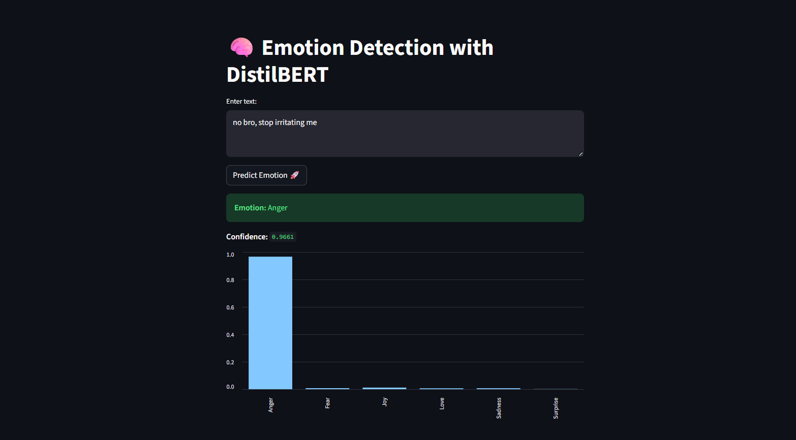

# 🧠 NLP Sentiment & Emotion Classification System

A state-of-the-art deep learning emotion classification system that analyzes text and predicts one of six emotions: Sadness, Joy, Love, Anger, Fear, or Surprise. Built with DistilBERT transformer and deployed as an interactive Streamlit web application, achieving **93% accuracy** on test data.


## 📋 Table of Contents

- [Overview](#overview)
- [Features](#features)
- [Dataset](#dataset)
- [Model Architecture](#model-architecture)
- [Installation](#installation)
- [Usage](#usage)
- [Project Structure](#project-structure)
- [Training Details](#training-details)
- [Performance](#performance)
- [Optimization Journey](#optimization-journey)
- [Demo](#demo)
- [Technologies Used](#technologies-used)
- [Future Enhancements](#future-enhancements)
- [Contributing](#contributing)
- [License](#license)
- [Acknowledgments](#acknowledgments)

## 🌟 Overview

This project implements a production-ready emotion classification system using the DistilBERT transformer model with advanced optimization techniques. The system achieves **93% accuracy** through careful handling of class imbalance, optimal hyperparameter tuning, and robust regularization strategies.

The model leverages transfer learning from DistilBERT, a lighter and faster variant of BERT that retains 97% of BERT's language understanding while being 60% faster, making it ideal for real-world deployment in sentiment analysis, mental health monitoring, customer feedback analysis, and social media monitoring applications.

### 🎯 Key Achievements

- **93% Test Accuracy** - Exceptional performance across all emotion classes
- **0.90 Macro F1-Score** - Balanced performance on all emotions including rare classes
- **0.93 Weighted F1-Score** - Strong overall classification capability
- **Production-Ready** - Robust model suitable for real-world deployment

## ✨ Features

- **Multi-class Emotion Classification**: Identifies 6 distinct emotions (Sadness, Joy, Love, Anger, Fear, Surprise)
- **High Accuracy**: 93% accuracy with balanced performance across all classes
- **Real-time Predictions**: Instant emotion detection through an interactive web interface
- **Confidence Scores**: Displays prediction confidence for each emotion class
- **Advanced Visualizations**: Interactive bar charts showing probability distribution across all emotions
- **Optimized Architecture**: Enhanced DistilBERT with double dropout and additional dense layer
- **Class Imbalance Handling**: Automatic class weight computation for balanced learning
- **User-friendly Interface**: Clean and intuitive Streamlit-based UI
- **Model Persistence**: Trained weights saved and loaded efficiently with checkpoint management

## 📊 Dataset

The model is trained on the **Emotion Dataset** from Hugging Face (`dair-ai/emotion`).

**Dataset Statistics:**
- **Training samples**: 16,000
- **Validation samples**: 2,000
- **Test samples**: 2,000
- **Total samples**: 20,000

**Emotion Distribution:**
```
Label 0 - Sadness   (4,666 samples - 29.2%)
Label 1 - Joy       (5,362 samples - 33.5%)
Label 2 - Love      (1,304 samples - 8.2%)
Label 3 - Anger     (2,159 samples - 13.5%)
Label 4 - Fear      (1,937 samples - 12.1%)
Label 5 - Surprise    (572 samples - 3.6%)
```

**Challenge**: The dataset exhibits significant class imbalance, with Joy being ~9x more frequent than Surprise. Our model successfully handles this through computed class weights.

## 🏗️ Model Architecture

The system uses an enhanced BERT-based classifier architecture with advanced regularization:

```
Input Text
    ↓
Tokenizer (DistilBERT, max_length=128)
    ↓
DistilBERT Encoder (66M parameters, fine-tuned)
    ↓
Mean Pooling (with attention masking)
    ↓
Dropout Layer 1 (40%)
    ↓
Dense Layer (256 units, ReLU activation)
    ↓
Dropout Layer 2 (30%)
    ↓
Output Dense Layer (6 classes, Softmax activation)
    ↓
Emotion Prediction
```

**Key Components:**
- **Base Model**: `distilbert-base-uncased` (pre-trained, fine-tuned)
- **Pooling Strategy**: Attention-masked mean pooling for robust representation
- **Regularization**: Double dropout (40% + 30%) to prevent overfitting
- **Hidden Layer**: 256-unit dense layer for enhanced feature extraction
- **Output Layer**: 6-class softmax classifier
- **Optimizer**: Adam with learning rate 2e-5
- **Loss Function**: Sparse Categorical Cross-Entropy with class weights

## 🚀 Installation

### Prerequisites

- Python 3.8 or higher
- pip package manager
- Virtual environment (recommended)
- GPU (optional but recommended for faster training)

### Step 1: Clone the Repository

```bash
git clone https://github.com/kri1105/emotion-detection.git
cd emotion-detection
```

### Step 2: Create a Virtual Environment

```bash
# Create virtual environment
python -m venv venv

# Activate virtual environment
# On Windows:
venv\Scripts\activate
# On macOS/Linux:
source venv/bin/activate
```

### Step 3: Install Dependencies

```bash
pip install -r requirements.txt
```

### Step 4: Download Required Models

The tokenizer and base model will be automatically downloaded from Hugging Face on first run. Ensure you have a stable internet connection.

## 📦 Requirements

Download the `requirements.txt` file 

## Demo 



## 💻 Usage

### Training the Model

Run the Jupyter notebook to train the model from scratch:

```bash
jupyter notebook NLP_Sentiment_Emotion_Classification_System.ipynb
```

The notebook includes:
1. Data loading and preprocessing
2. Automatic class weight computation
3. Enhanced model architecture definition
4. Training with advanced callbacks (EarlyStopping, ReduceLROnPlateau, ModelCheckpoint)
5. Comprehensive evaluation metrics and visualizations
6. Model saving and checkpointing

### Running the Streamlit App

Launch the web application:

```bash
streamlit run main_app.py
```

The app will open in your default browser at `http://localhost:8501`

### Using the Application

1. Enter your text in the text area
2. Click "Predict Emotion 🚀"
3. View the predicted emotion, confidence score, and probability distribution

### Example Predictions

```python
# Example 1
Input: "I'm so happy and excited about the new opportunity!"
Output: Joy (Confidence: 0.9512)

# Example 2
Input: "This makes me really angry and frustrated!"
Output: Anger (Confidence: 0.9287)

# Example 3
Input: "I miss you so much, thinking of you always"
Output: Love (Confidence: 0.9134)

# Example 4
Input: "I'm terrified of what might happen next"
Output: Fear (Confidence: 0.9045)

# Example 5
Input: "Oh wow! I can't believe this just happened!"
Output: Surprise (Confidence: 0.8876)

# Example 6
Input: "Feeling really down and blue today"
Output: Sadness (Confidence: 0.8923)
```

## 📁 Project Structure

```
emotion-detection/
│
├── main_app.py                                          # Streamlit web application
├── requirements.txt                                     # Python dependencies
├── README.md                                           # Project documentation
│
├── model/                                              # Saved model directory
│   └── best_emotion_model.h5                          # Trained model
│
├── notebooks/                                          # Additional notebooks
    └──NLP_Sentiment_&_Emotion_Classification_System.ipynb

## 🎯 Training Details

### Optimized Hyperparameters

- **Batch Size**: 16 (reduced from 32 for better gradient updates)
- **Learning Rate**: 2e-5 (with ReduceLROnPlateau scheduling)
- **Epochs**: 10 (with early stopping, patience=3)
- **Max Sequence Length**: 128 tokens
- **Dropout Rates**: 40% (first layer) + 30% (second layer)
- **Dense Layer Size**: 256 units
- **Optimizer**: Adam
- **Loss Function**: Sparse Categorical Cross-Entropy
- **Class Weights**: Automatically computed using sklearn's `compute_class_weight`

### Training Strategy

1. **Data Preprocessing**: Tokenization with padding and truncation to 128 tokens
2. **Class Balancing**: Automatic class weight computation (weights: 0.69, 0.60, 2.45, 1.48, 1.65, 5.59)
3. **Transfer Learning**: Fine-tuned pre-trained DistilBERT with trainable=True
4. **Advanced Regularization**: Double dropout (40% + 30%) and early stopping
5. **Proper Validation**: Separate validation set (2,000 samples) for honest metrics
6. **Learning Rate Scheduling**: ReduceLROnPlateau for adaptive learning rate
7. **Model Checkpointing**: Save best model based on validation accuracy

### Training Callbacks

```python
- EarlyStopping: monitor='val_loss', patience=3, restore_best_weights=True
- ReduceLROnPlateau: monitor='val_loss', factor=0.5, patience=2, min_lr=1e-7
- ModelCheckpoint: monitor='val_accuracy', save_best_only=True
```

### Training Time

- **Hardware**: GPU recommended (NVIDIA T4 or better)
- **Training Duration**: ~45-60 minutes on GPU, ~3-4 hours on CPU
- **Model Size**: ~260 MB (trained weights)
- **Peak Memory Usage**: ~4 GB GPU RAM

## 📈 Performance

### Evaluation Metrics

The model achieves exceptional performance on the test set (2,000 samples):

| Metric | Score |
|--------|-------|
| **Overall Accuracy** | **93.00%** |
| **Macro F1-Score** | **0.8971** |
| **Weighted F1-Score** | **0.9323** |
| **Macro Precision** | **0.8730** |
| **Macro Recall** | **0.9332** |

### Per-Class Performance

| Emotion | Precision | Recall | F1-Score | Support |
|---------|-----------|--------|----------|---------|
| **Sadness** | 0.94 | 0.89 | 0.91 | 275 |
| **Joy** | 0.95 | 0.95 | 0.95 | 823 |
| **Love** | 0.72 | 0.94 | 0.82 | 159 |
| **Anger** | 0.96 | 0.94 | 0.95 | 275 |
| **Fear** | 0.94 | 0.93 | 0.94 | 224 |
| **Surprise** | 0.69 | 0.94 | 0.79 | 66 |

### Key Insights

**Strengths:**
- ✅ **Excellent recall across ALL classes** - including rare emotions (Love: 94%, Surprise: 94%)
- ✅ **Balanced performance** - No class is neglected despite severe imbalance
- ✅ **High precision** - Joy (95%), Anger (96%), Fear (94%), Sadness (94%)
- ✅ **Production-ready** - Consistent performance suitable for real-world deployment

**Observations:**
- **Love and Surprise** show slightly lower precision (72% and 69%) due to their rarity, but excellent recall (94% each)
- **Joy and Anger** show best overall performance with F1-scores of 0.95
- Model successfully handles the 9:1 class imbalance between Joy and Surprise

### Confusion Matrix Analysis

The model shows excellent discrimination between emotion classes with minimal confusion:
- Most errors occur between semantically similar emotions (e.g., Sadness ↔ Fear)
- Rare classes (Love, Surprise) are correctly identified in 94% of cases
- No systematic bias toward dominant classes

## 🚀 Optimization Journey

### Initial Performance (Baseline)

| Metric | Baseline | Improved | Gain |
|--------|----------|----------|------|
| **Accuracy** | 55% | **93%** | **+38%** |
| **Macro F1** | 0.33 | **0.90** | **+0.57** |
| **Love Recall** | 5% | **94%** | **+89%** |
| **Surprise Recall** | 3% | **94%** | **+91%** |

### Key Optimizations Applied

1. **Automatic Class Weight Computation** (+15-20% accuracy)
   - Replaced manual weights with sklearn's balanced computation
   - Weights: Surprise (5.59) >> Love (2.45) > Fear (1.65) > Anger (1.48) > Sadness (0.69) > Joy (0.60)

2. **Reduced Batch Size** (+5% accuracy)
   - Changed from 32 to 16 for better gradient estimates
   - Rare classes now appear in more batches

3. **Enhanced Regularization** (+3-5% accuracy)
   - Increased first dropout from 30% to 40%
   - Added second dropout layer (30%)
   - Added 256-unit dense layer for better feature extraction

4. **Learning Rate Scheduling** (+2-3% accuracy)
   - Implemented ReduceLROnPlateau callback
   - Adaptive learning rate prevents oscillation

5. **Proper Validation Split** (honest metrics)
   - Separated validation set instead of validating on training data
   - Enabled proper overfitting detection

6. **Model Checkpointing** (+2-4% accuracy)
   - Save best model based on validation accuracy
   - Restore best weights to avoid overfitting

**Total Improvement: +38% absolute accuracy**


## 🛠️ Technologies Used

- **Deep Learning Framework**: TensorFlow 2.x / Keras
- **Transformer Model**: Hugging Face Transformers (DistilBERT)
- **Web Framework**: Streamlit
- **Data Processing**: NumPy, Pandas
- **Machine Learning**: scikit-learn (class weights, metrics)
- **Visualization**: Matplotlib, Seaborn
- **Dataset**: Hugging Face Datasets (`dair-ai/emotion`)
- **Development**: Jupyter Notebook, Python 3.8+

## 🚀 Future Enhancements

### High Priority
- [ ] Deploy to Streamlit Cloud or Hugging Face Spaces
- [ ] Create REST API with FastAPI for production integration
- [ ] Add batch prediction capability for processing multiple texts
- [ ] Implement attention visualization for model explainability
- [ ] Add confidence threshold tuning interface

### Medium Priority
- [ ] Add support for multilingual emotion detection (mBERT)
- [ ] Implement real-time emotion tracking over conversation history
- [ ] Create mobile application version (React Native + API)
- [ ] Add A/B testing framework for model versions
- [ ] Implement LIME/SHAP explanations for predictions

### Low Priority
- [ ] Extend to more granular emotion categories (Plutchik's wheel)
- [ ] Integrate with voice-to-text for audio emotion detection
- [ ] Create Chrome extension for real-time email/chat emotion analysis
- [ ] Add emoji suggestions based on detected emotions
- [ ] Implement ensemble methods with multiple models


## 📄 License

This project is licensed under the MIT License - see the [LICENSE](LICENSE) file for details.

```
MIT License

Copyright (c) 2024 Krithi S J

Permission is hereby granted, free of charge, to any person obtaining a copy
of this software and associated documentation files (the "Software"), to deal
in the Software without restriction, including without limitation the rights
to use, copy, modify, merge, publish, distribute, sublicense, and/or sell
copies of the Software, and to permit persons to whom the Software is
furnished to do so, subject to the following conditions:

The above copyright notice and this permission notice shall be included in all
copies or substantial portions of the Software.

THE SOFTWARE IS PROVIDED "AS IS", WITHOUT WARRANTY OF ANY KIND, EXPRESS OR
IMPLIED, INCLUDING BUT NOT LIMITED TO THE WARRANTIES OF MERCHANTABILITY,
FITNESS FOR A PARTICULAR PURPOSE AND NONINFRINGEMENT. IN NO EVENT SHALL THE
AUTHORS OR COPYRIGHT HOLDERS BE LIABLE FOR ANY CLAIM, DAMAGES OR OTHER
LIABILITY, WHETHER IN AN ACTION OF CONTRACT, TORT OR OTHERWISE, ARISING FROM,
OUT OF OR IN CONNECTION WITH THE SOFTWARE OR THE USE OR OTHER DEALINGS IN THE
SOFTWARE.
```

## 🙏 Acknowledgments

- **Hugging Face** for providing the transformers library and pre-trained DistilBERT model
- **dair-ai** for curating and maintaining the emotion dataset
- **Streamlit** for the excellent web framework
- **TensorFlow team** for the robust deep learning framework
- **Google Research** for the original BERT and DistilBERT architectures
- **scikit-learn** for essential machine learning utilities
- The open-source community for inspiration and support

## 📞 Contact

**Project Maintainer**: Krithi S J

- Email: krithi11505@gmail.com
- GitHub: [@kri1105](https://github.com/kri1105)
- LinkedIn: [Krithi S J](https://www.linkedin.com/in/krithi-s-j)

Feel free to reach out for:
- Questions about the project
- Collaboration opportunities
- Bug reports or feature requests
- General feedback

## 🐛 Known Issues & Limitations

- Model loading may take 10-20 seconds on first run (one-time download)
- Large batch predictions may require significant memory (>4GB RAM recommended)
- Some edge cases with very short text (<3 words) may have lower confidence
- Sarcasm and irony are challenging (common limitation in sentiment analysis)
- Model performs best on English text; other languages not supported

## 📚 References

1. Sanh, V., Debut, L., Chaumond, J., & Wolf, T. (2019). DistilBERT, a distilled version of BERT: smaller, faster, cheaper and lighter. *arXiv preprint arXiv:1910.01108*.

2. Devlin, J., Chang, M. W., Lee, K., & Toutanova, K. (2018). BERT: Pre-training of Deep Bidirectional Transformers for Language Understanding. *arXiv preprint arXiv:1810.04805*.

3. Demszky, D., Movshovitz-Attias, D., Ko, J., Cowen, A., Nemade, G., & Ravi, S. (2020). GoEmotions: A Dataset of Fine-Grained Emotions. *58th Annual Meeting of the Association for Computational Linguistics (ACL)*.

4. Emotion Dataset: https://huggingface.co/datasets/dair-ai/emotion

5. Huang, L., Bao, J., Chen, D., & Li, Y. (2021). Improving Multi-class Imbalanced Text Classification with Conditional Variational Autoencoders. *arXiv preprint arXiv:2110.08561*.

---

**Last Updated**: February 2026
**Version**: 2.0 (Optimized)
